### What is AEGON?

AEGON(AI Engine for Governance Of Networks) is a tool that seeks to use AI driven techniques to provide an operationalised layer between natural language policies and the technical based network device configuration files.  It serves as an auditing tool that generates the compliance state of a network device and produces explainability regarding each control it classified.

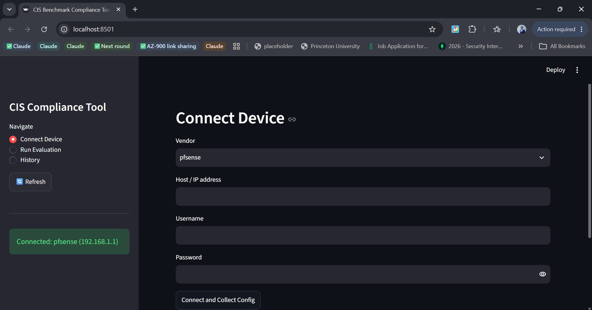

*Figure 18: A figure illustrating the connection page of AEGON.*

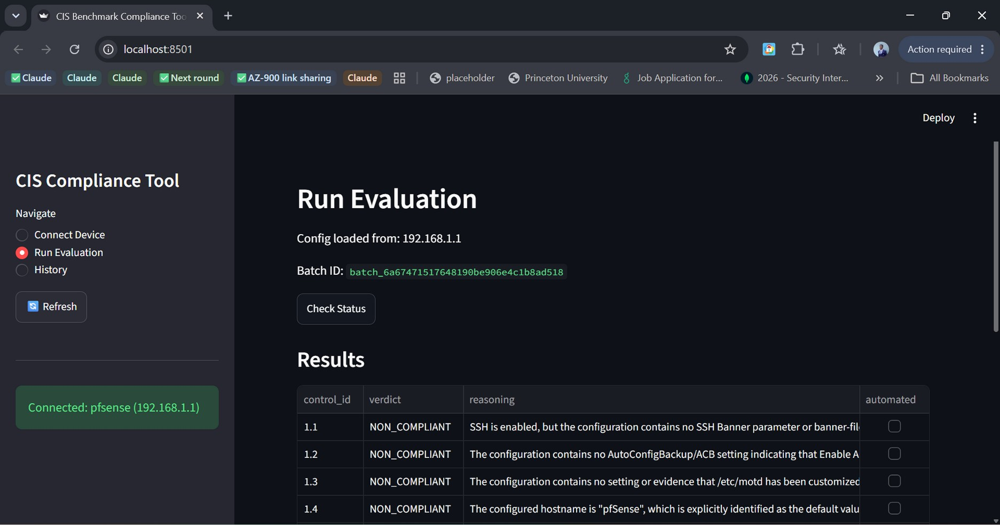

*Figure 19: A figure illustrating the evaluation page of AEGON.*

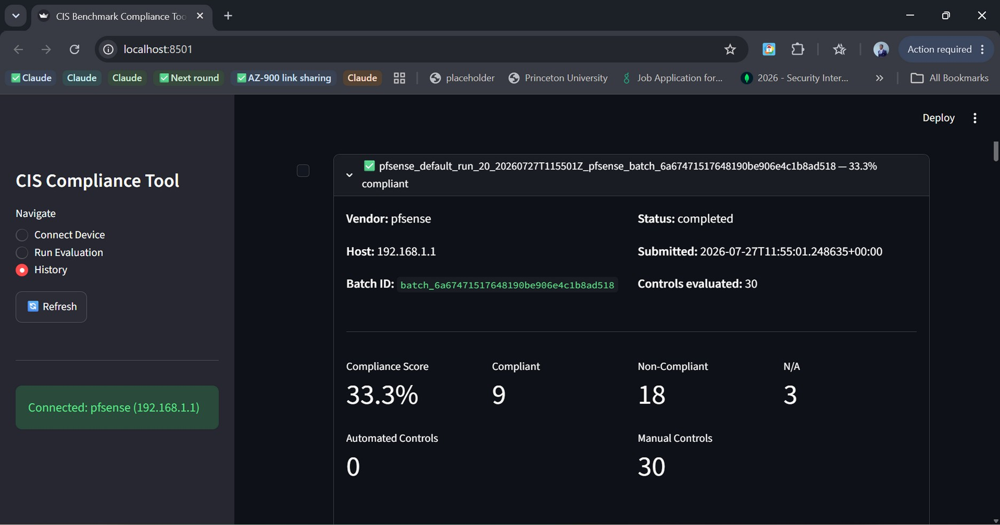

*Figure 20: A figure illustrating the history page of AEGON.*

### System Architecture

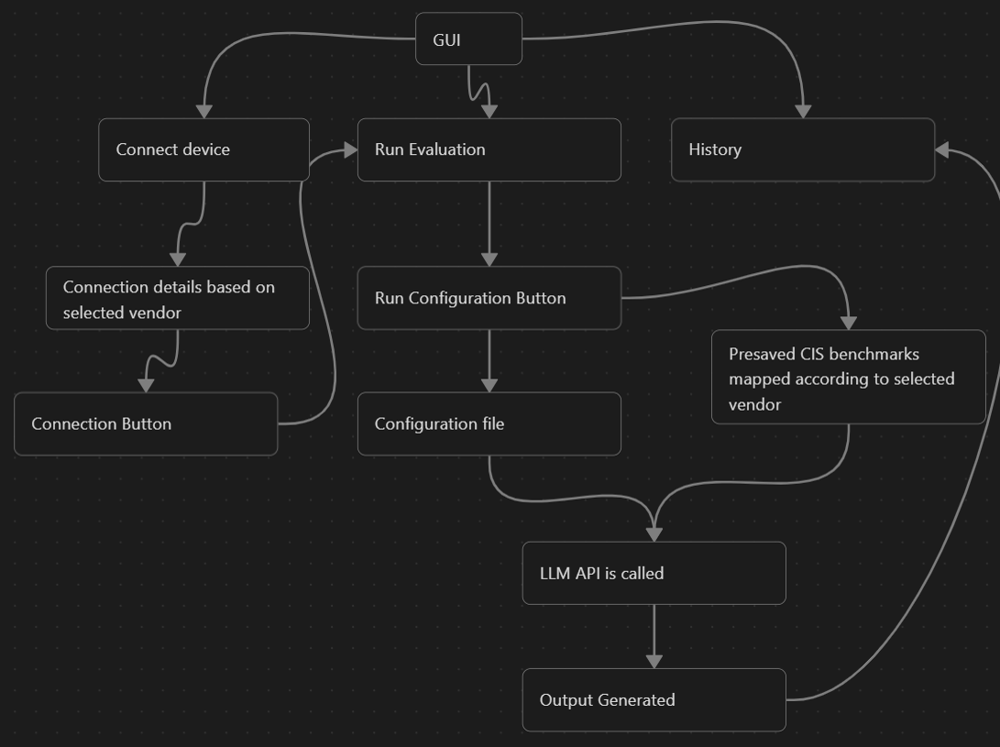

*Figure 13: A figure illustrating the system architecture of the dissertation artefact.*

The above image details the system architecture of the tool which comprises of a four stage process. A connection stage and retreival stage, an evaluation stage, a verdict generation stage, and an output storage stage. Three different network vendors were used in the development of the tool, with Cisco IOS XE, Juniper JunOS, and pfSense representing the devices used for this project. The Cisco and Juniper devices established the connection and retreived the configuration state of the device through the Netmiko library, The pfSense device however offered no Netmiko support as it was a GUI based system with a shell representation for the CLI, hence Paramiko, which is the foundation of Netmiko, was utilised in the collection of the configuration of the pfSense device.

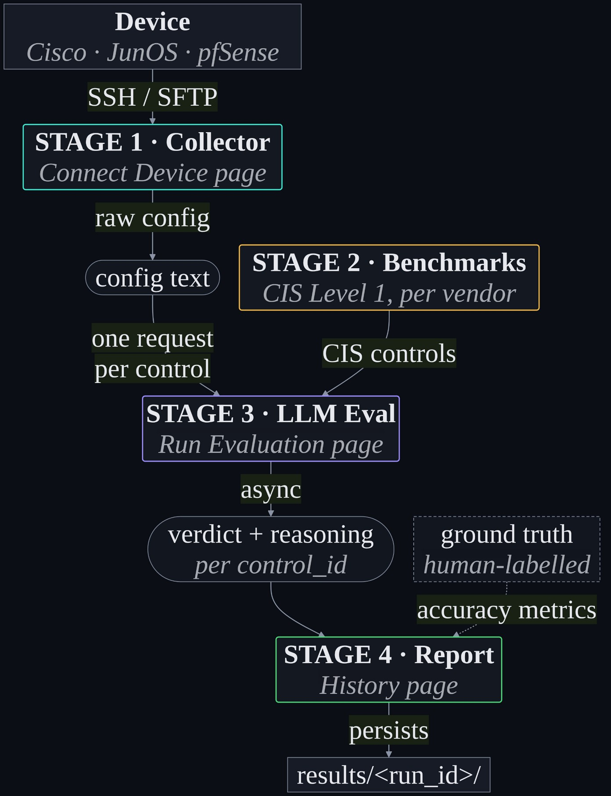

*Figure 14: An image illustrating the run flow of AEGON (generated by Claude).*

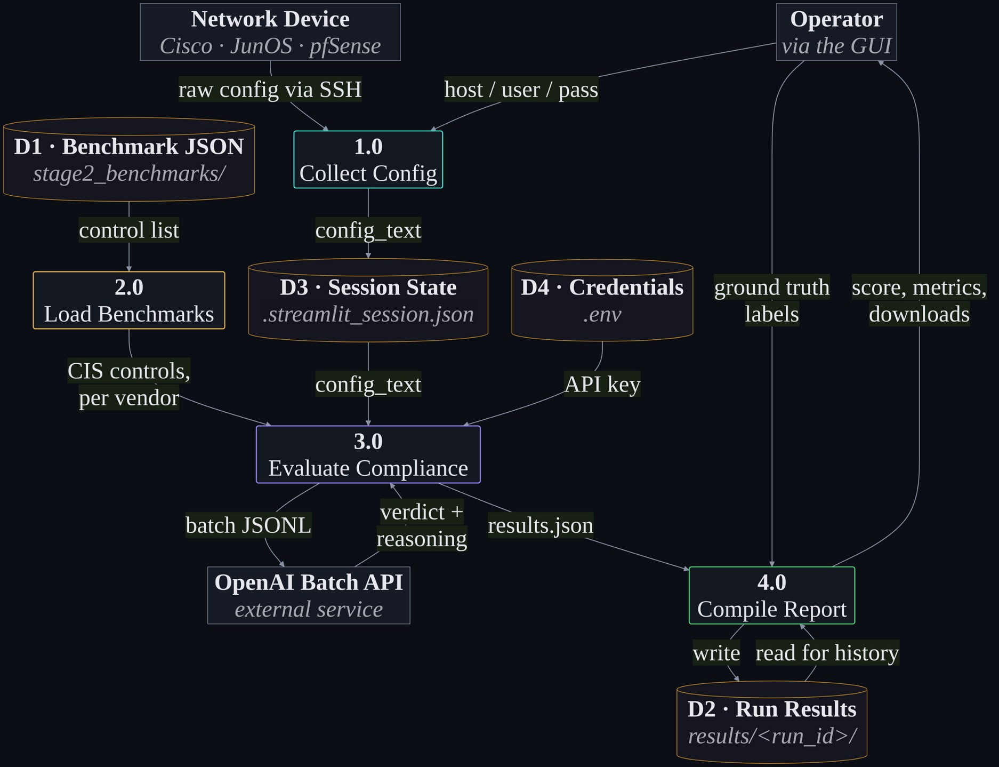

*Figure 16: An image illustrating the data flow of AEGON (generated by Claude).*

### Problems Encountered

pfSense CIS control 1.1 was discovered as a structural limitation; AEGON cannot physically assess it, as it is not a configuration-level control. pfSense has no GUI field and no config.xml storage for the SSH banner, requiring filesystem-level edits that sit outside config.xml in order to configure the SSH banner required by the CIS control. As this is a data availability gap and not an accuracy failure, a compliance state cannot be verified by the tool, as there is no information to access, establishing it as an edge case that binary pass/fail check tools cannot quantify using configuration-level file retrieval for the pfSense device.

On the 6th of July 2026, an architecture design of one configuration mapped to many controls, forcing the LLM to receive a fully unchanged configuration text each time with a different CIS control’s exact text on each API call in order to avoid cross-dependency influences in the controls and ensure full context comprehension on each configuration led to rate-limiting challenges by the free-tier commodity LLM being used during the pilot run. An initial diagnosis of tokens per minute led to an applied 15-second wait on failure; after continuing rate-limiting challenges, a different diagnosis of rate limits per day was found to be the roadblock in the generation of a full verdict by the LLM. An alternative fix to the solution involved integrating several controls into one API call, which would have led to cross-dependency influences in the CIS controls that were deliberately avoided in the architectural design. Instead, a different model on the same LLM provider, "Groq", which provided higher limits but a lower call processing rate, and reasoning effort was utilised. While this led to more verdict generations by the LLM, there was still a hard limit on token processing by free-tier commodity LLM providers, prompting the switch to the GPT-5.6-Terra model, which introduced the cost metric, and the asynchronous batch API.

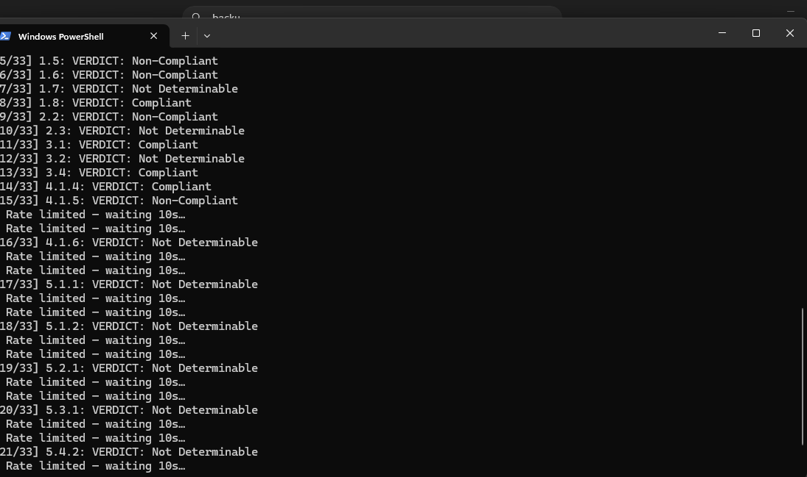

*Figure 5: A figure displaying the rate-limiting challenge with commodity-tier LLMs.*

On the 12th of July 2026, a vSRX node built in GNS3 hosted on the GCP VM refused to establish reachability. A cloud node with access to the VM was created on the GNS3 emulator in order to connect the JunOS vSRX virtual image to the VM for SSH reachability by AEGON. The initial problem was a failure to boot, with the boot showing a repeating loop after the “Reconfiguring vtnet0 to fxp0” error, running 30+ minutes with no login prompt. An attempted fix that involved setting "create_config-disc: true” on both the node and the template via the API led to a complete freeze much earlier in the boot that confirmed the applied fix as the wrong one. 

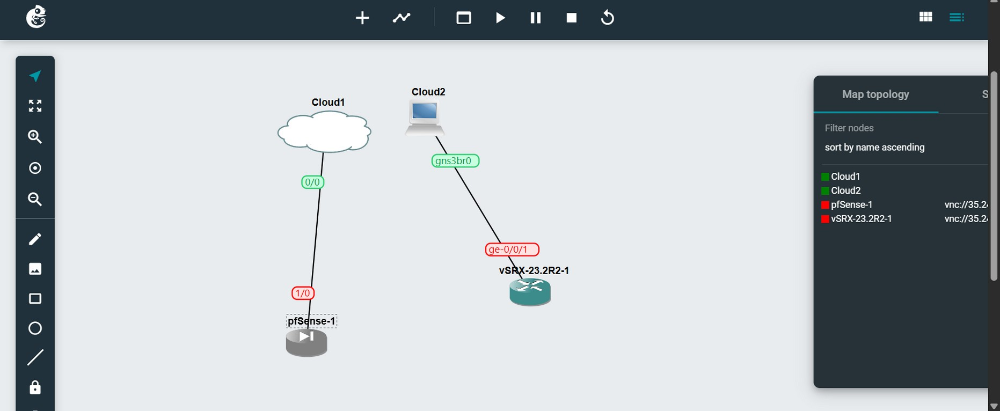

*Figure 25: A figure illustrating the GNS3 emulator hosting the pfSense and Juniper virtual images.*

After further research confirmed the long boot time as a normal behaviour for first-time vSRX booting, the control plane worked fine, with control plane commands such as CLI and configure working; the dataplane, however, refused to come up, preventing network reachability. The first diagnosis was to bring the FPC online manually, which failed because as a virtual image, there was no FPC hardware to bring online. The second diagnosis involved increasing the CPU or RAM to start the dataplane; this, however, failed to succeed as the dataplane never came up regardless of RAM increase. The third diagnosis involved investigating the GNS3 wiring, which was revealed to be properly linked. 

On the 14th of July 2026, a pivot towards a vJunos-router was considered; it consisted of performance and compatibility tradeoffs which led to further investigation into the vSRX dataplane problem. A “show chassis fpc” command revealed a state of present and not online, indicating an infrastructure-level problem. Further investigation into the virtualisation state of the device indicated nested virtualisation was not enabled, a key functionality for device-level emulation and not pure software emulation. Attempts to enable nested virtualisation failed and broke the node, with further investigation revealing an incompatible VM state against nested virtualisation, which prompted the migration of the VM cloud instance on to another machine type that enabled nested virtualisation. This approach seemed to fix the problem, with the vSRX device establishing reachability and the dataplane successfully coming up.

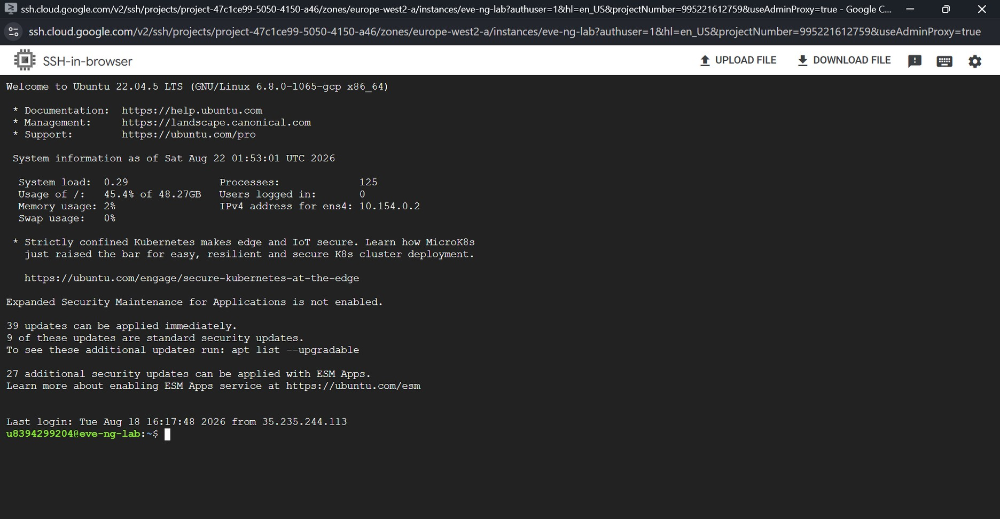

*Figure 26: A figure illustrating access to the GCP VM through the SSH protocol.*

### Software and Hardware Requirements

AEGON was developed through the use of Python version 3.10.12, with a Linux operating system developed and deployed on Ubuntu 22.04 LTS. While no OS-specific calls were made in the development and deployment of the tool, other operating systems remain untested, leaving the Linux operating system as the only validated functional platform for the tool. The table below highlights the Python packages used by the Python language in the development of AEGON.

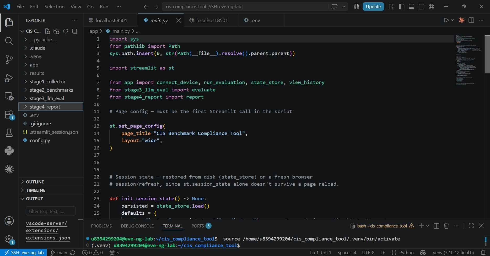

*Figure 17: A figure illustrating the Visual Studio cloud shell.*

| Package       | Version Used | Purpose                                                                |
| ------------- | ------------ | ---------------------------------------------------------------------- |
| Streamlit     | 1.59.0       | Development of the GUI-based interface.                                |
| Netmiko       | 4.7.0        | SSH automation for Cisco/JunOS configuration retrieval.                |
| Paramiko      | 4.0.0        | SFTP automation for pfsense’s configuration retrieval.                 |
| OpenAI        | 2.45.0       | To enable the batch API connection in the stage 3 LLM evaluation layer |
| Python-dotenv | 1.2.2        | To load the OpenAI key from .env                                       |

Table 10: A table illustrating the Python dependencies required by AEGON.

An OpenAI account with Batch API access to the gpt-5.6-terra model and a project-scoped API key with sufficient permissions was used in the development of AEGON. Any artificial intelligence provider with an exposed API endpoint could, however, be used in the evaluation layer of AEGON. Access to the Cisco DevNet Sandbox, JunOS and pfSense images with SSH functionality enabled is required for network reachability, with no offline mode functionality present within AEGON. There is no external storage service or database required to store the files, as all files exist in a flat storage state comprised of JSON files and one pfSense XML file under a “results/” directory.

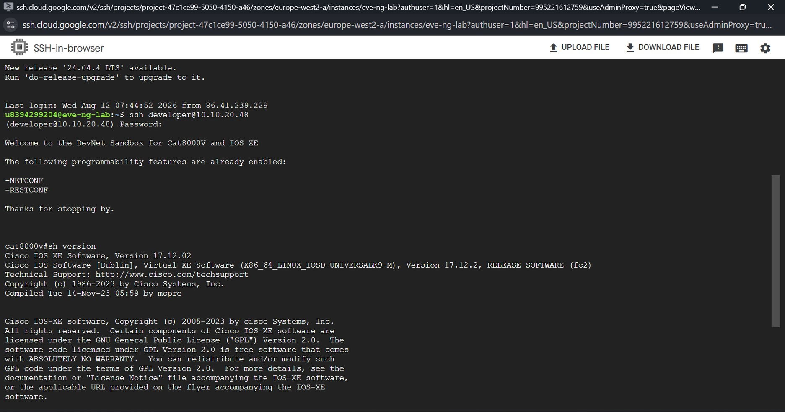

*Figure 21: A figure illustrating Cisco DevNet Sandbox CLI access through the SSH protocol.*

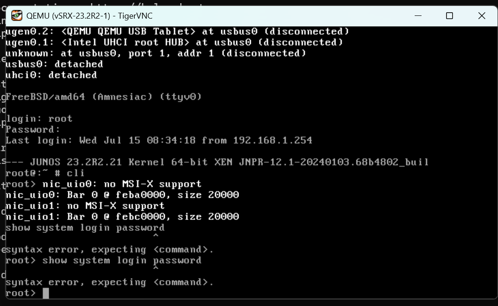

*Figure 22: A figure illustrating Juniper CLI access.*

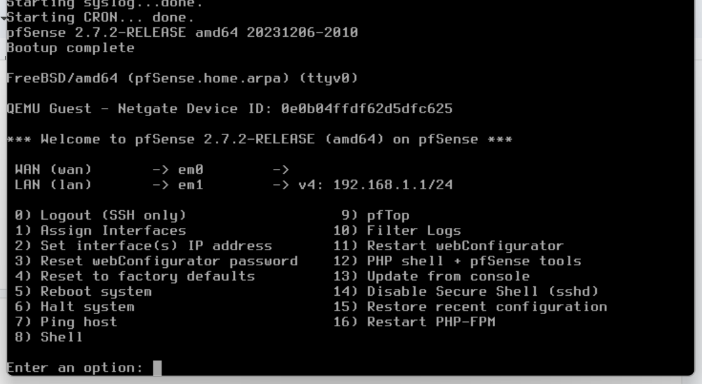

*Figure 23: A figure illustrating pfSense CLI access.*

The minimum hardware required to run AEGON involves a 1-core CPU, as no heavy local computation occurs. 1 GB of RAM for the Python/Streamlit process, 50 MB of total disc space, outbound network reachability to the API endpoint, and SSH reachability to whatever devices are currently being audited.

### Key Findings

The pfSense device experienced an alarming drop in its maximum compliance configuration state, dropping below 70% across all 3 compliance state runs. This drop is attributed to pfSense’s heavily GUI-based interaction workflow, with all existing controls existing as a manual remediation format, leaving a considerable amount of GUI based changes out of the configuration. pfSense also utilises a default omission design architecture, where defaults are excluded from the configuration, treating absence as the compliant state for certain controls. In a maximum configuration compliance state run, this is especially highlighted, with the LLM continuously treating absence as a failure to the adherence of the control, leading to a significant decline in the accuracy metric of the pfSense device for that specific configuration compliance state. 

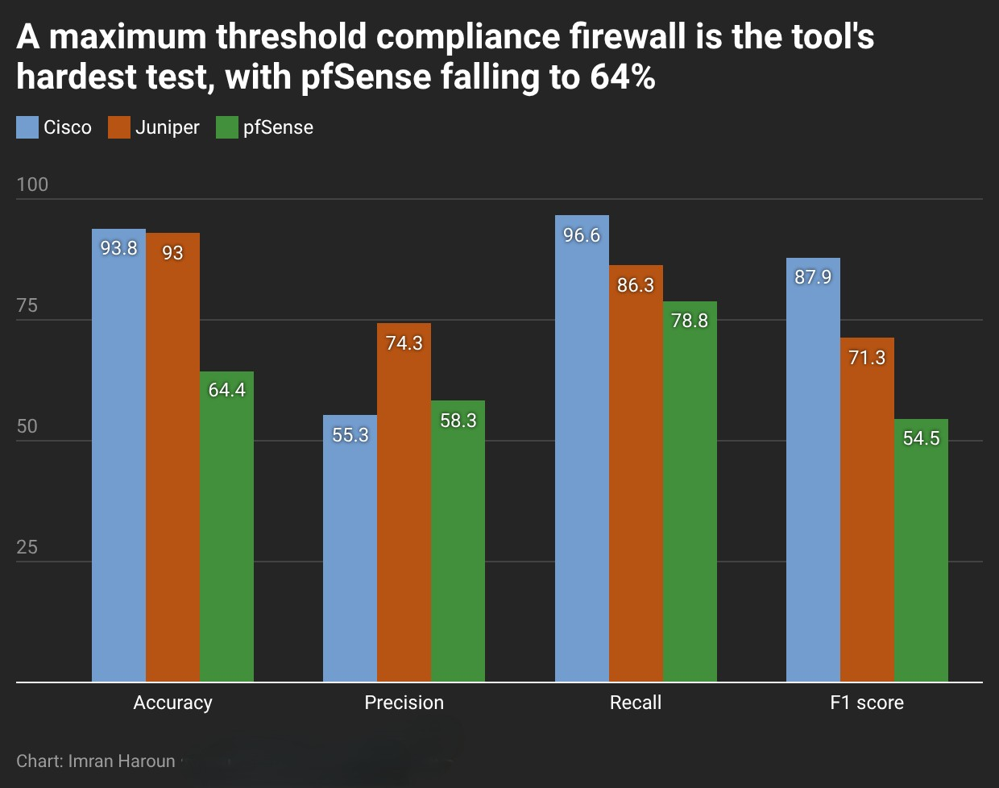

*Figure 29: A figure illustrating the aggregated accuracy, precision, recall, and F1 score of the maximum compliance configuration states of 3 devices across 3 runs.*

There is an imbalance between the precision and recall results, particularly in the Cisco and pfSense device’s maximum compliance and maximum non-compliance state results. This can be attributed to the imbalance created between the three compliant verdicts: Compliant, Non-compliant, N/A. Each verdict is treated equally regardless of their actual amount in the result, leaving fewer verdicts carrying more weight in the calculation of the precision output. In Cisco’s case, N/A rarely ever shows up, and in the rare case that it does show up and is misattributed, it drags the entire average down with it. This was a deliberate architecture design implemented in order to not have silent misses by the tool get glossed over due to rarity of occurrence. 

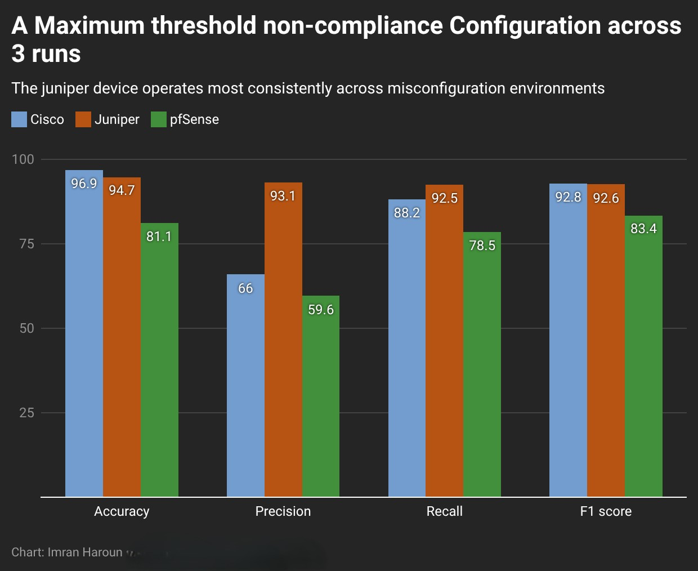

*Figure 30: A figure illustrating the aggregated accuracy, precision, recall, and F1 score of the maximum non-compliance configuration states of 3 devices across 3 runs.*

The bias in the ground truth was exposed, with the same structural limitations being graded differently across devices. Control 1.1 on pfSense was identified as a structural limitation and was assigned an N/A verdict. The 1.5.10 control on Cisco belonged to the same structural limitation group as the pfSense 1.1 control; it was, however, misattributed as either a compliant or non-compliant verdict on the ground truth label. AEGON continuously flagged the tool as N/A, but the inherent bias in the ground truth flagged that as an inaccuracy each time, single-handedly dragging the precision metric down each time. This finding highlights bias within the ground truth label that may properly or improperly represent the metrics against which the tool is being compared.

The consistency metric is inherently skewed on whole averages. For the total consistency metric, the default configuration consistency verdicts have to agree a total of 20 times to be included, while the compliant or non-compliant configuration consistency verdicts have to agree just a total of 3 times to be included; this creates a skew in favour of the compliance and non-compliant configuration states. Probable consistency does not face the same level of imbalance as total consistency, as it is measured per verdict instead of per group. But probable consistency also skews in favour of the default configuration state, as it consists of more verdicts than the compliance and non-compliance configuration states.

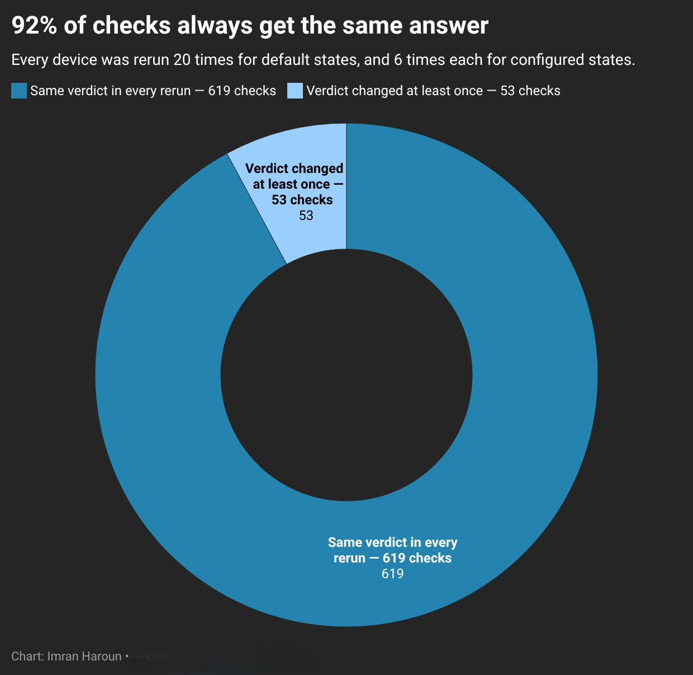

*Figure 32: Total consistency across 672 checks.*

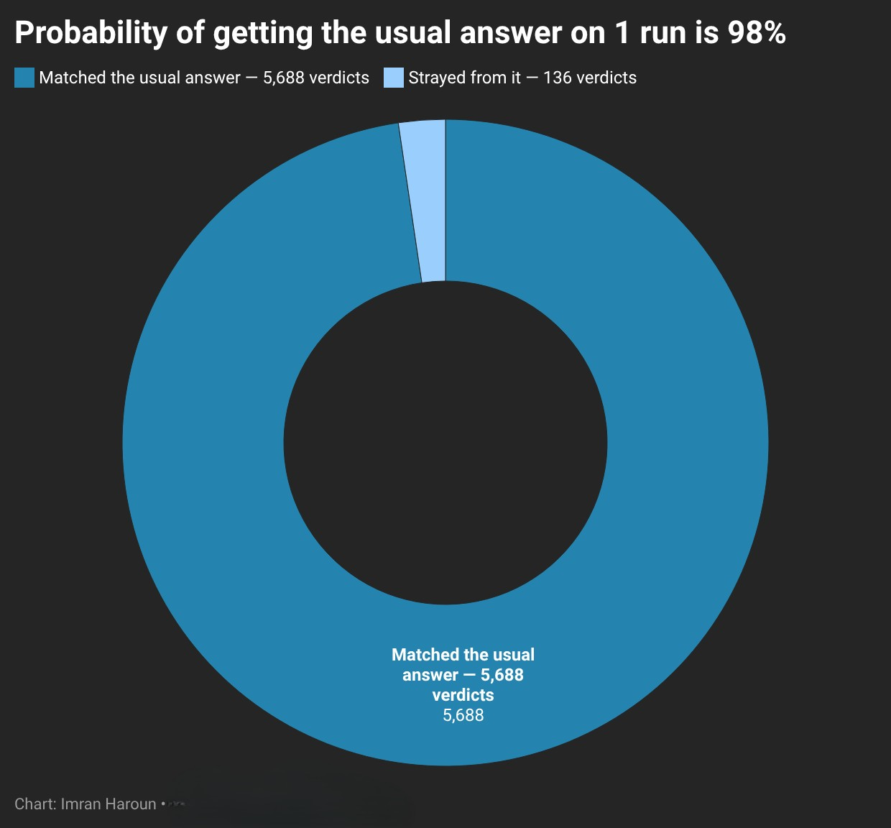

*Figure 33: Probable consistency across 5824 verdicts.*

Consistency and accuracy were also found not to be directly correlated, as an inaccurate verdict can be continuously selected by AEGON every time, leading to the creation of two different verdicts. The strongest example of this was the pfSense 1.1 default state control. A verdict of Non_Compliant was reached by AEGON 20 times over 20 runs. Total consistency includes this verdict in the calculation of its metric, even though that verdict is inherently accurate. This finding serves to illustrate the distinctions between the consistency and accuracy metrics.

Batch API is not advisable for critical production networks or live assessment. This was apparent in the first pfSense run, which took 26 minutes to generate a complete verdict. In critical applications or live audit assessments, this could cause delays which could produce consequential results in a real-world context. 

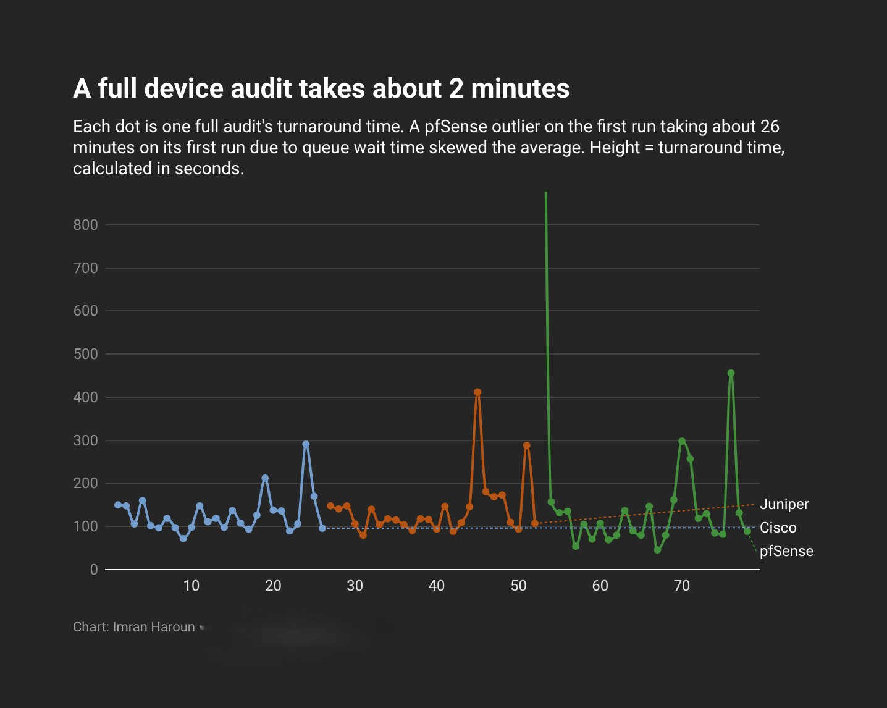

*Figure 37: Audit time across all 78 runs.*

A typical run was found to be under 2 minutes for every evaluated device. This speed in execution was found to correlate strongly with the average run time for every device, with the 26-minute outlier by the pfSense device skewing the mean rate and pushing the total mean time taken to complete an execution to over 3 minutes. Maximum compliance configuration states were also found to be the quickest to audit; albeit having 17 fewer runs than the default configuration state, this speed in audit time can be attributed to more matchable patterns by AEGON, generating an increase in speed due to the straightforward and sometimes shorter task of verifying state from an identified control pattern.

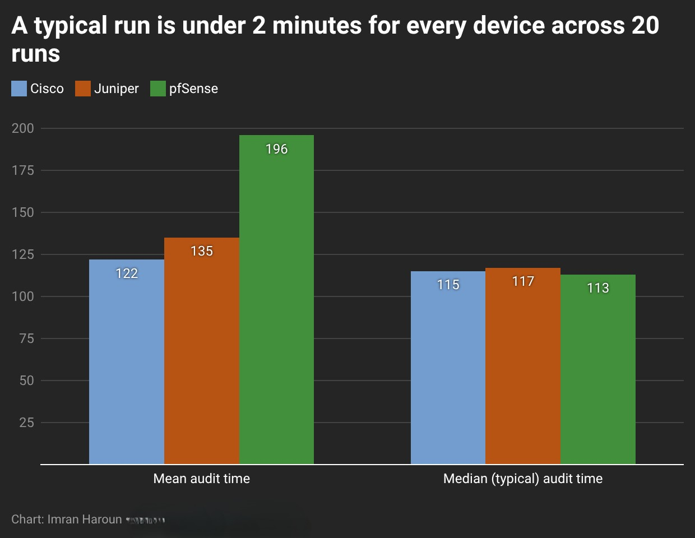

*Figure 38: Mean and median audit time for default configuration state.*

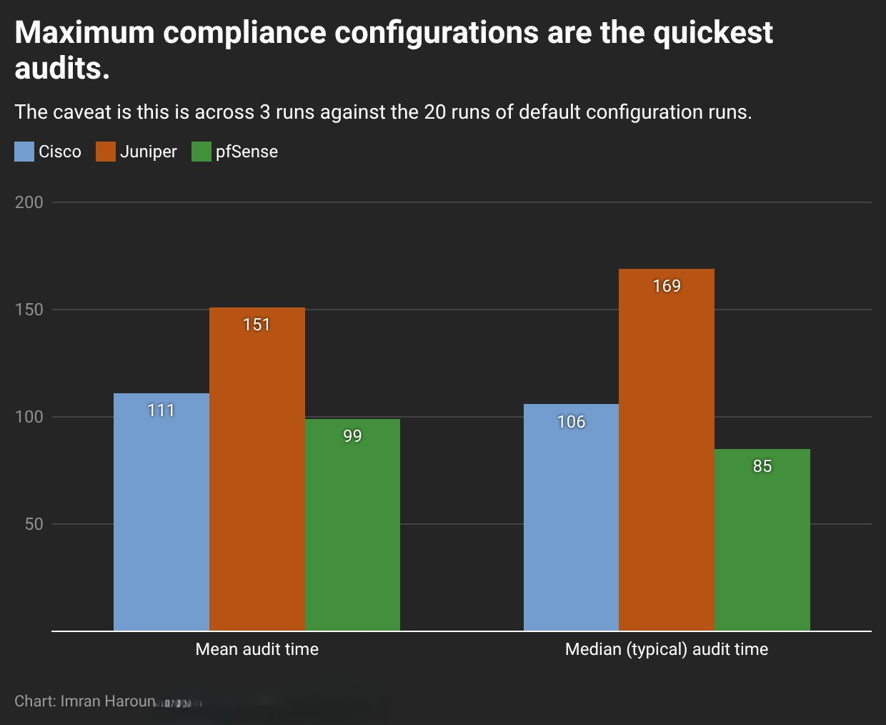

*Figure 39: Mean and median audit time for maximum compliance configuration state.*

No audit costs more than 13 cents, with maximum compliant configuration states costing more. This is because cost per run is almost entirely derived from input tokens, with substantially fewer output tokens. A compliant configuration requires more configuration data present on its configuration file, leading it to possess substantially more input tokens than the default or non-compliance configuration state. Since a bigger file leads to more input tokens ingested by the LLM, the cost of processing compliant configuration runs positively correlates with the size of the configuration file data.

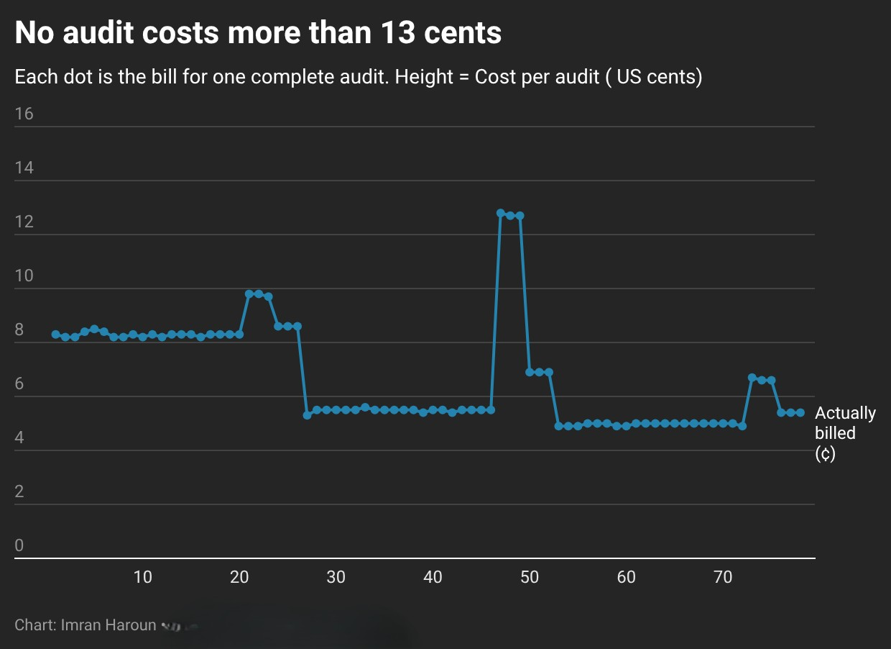

*Figure 42: Billing cost across all 78 runs.*

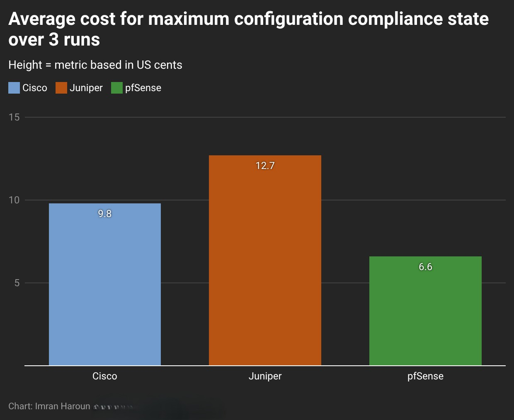

*Figure 44: Billing costs for maximum compliance configuration state across 3 runs.*

### Constraints

- Limited time

- Third-Party API Provider reducing control over test environment

- Quantity of Context Provision 

- Single device upload and evaluation

- Discounted cost of the model used during the project may not reflect future prices

- Untested full format device configuration upload on every call configuration design.

- Evaluation using just a single model

- Non-Determinism of the tool

### Conclusion

This project sought out to highlight the use of AI as a compliance engine in network compliance assessment; it illustrates the use cases and limitations of the developed tool. It doesn’t call for the replacement of experts but argues for integration alongside experts to provide maximum aid in compliance assessment. It serves to show that although the developed tool is not perfect, it is a functional tool with its own use cases.
